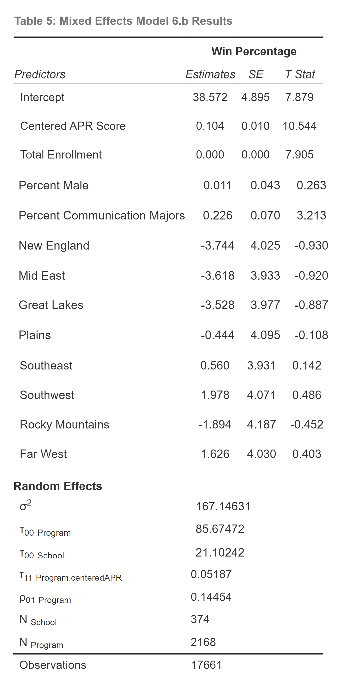

```{r setup, include=FALSE}
knitr::opts_chunk$set(echo = FALSE, message = FALSE, warning=FALSE)
```

```{r, warning=FALSE}
library(MASS)
library(gridExtra)  
library(mnormt) 
library(lme4) 
library(knitr) 
library(kableExtra)
library(tidyverse)
library(GGally)
library(mice)
library(nlme)
library(boot)
library(HLMdiag)
library(pander)
library(skimr)
library(corrplot)
library(sjPlot)
library(stargazer)
library(lmerTest)
```

```{r}
sports <- read.csv("Full_Data.csv")
```

```{r, results = "hide"}
sports %>% count(School)
sports %>% count(Start.Year)
```


```{r, results = 'hide'}
select <- dplyr::select
keydata <- sports %>% 
  dplyr::select(Program,
      Pct, Start.Year, Sport, School, State, Multi.Year.APR)
# Create Level2 data set by picking off one observation 
# per subject, which would be easier if every subject 
# had a diary entry labeled '1' - should be 37 rows 
# and 6 columns (one per L2 variable)
school.lev2 <-  keydata %>%
  group_by(School) %>%
  filter(row_number() == 1) %>%
  select(School, Start.Year)

year.lev2 <-  keydata %>%
  group_by((Start.Year)) %>%
  filter(row_number() == 1) %>%
  select(School, Start.Year)
```

```{r}
meanbyschool <- sports %>% group_by(School) %>%
  summarise(meanbyschool = mean(Multi.Year.APR, na.rm = TRUE))
school.lev2 <- school.lev2 %>%
  left_join(meanbyschool, by = "School")

meanbyyear <- sports %>% group_by(Start.Year) %>%
  summarise(meanbyyear = mean(Multi.Year.APR, na.rm = TRUE))
year.lev2 <- year.lev2 %>%
  left_join(meanbyyear, by = "Start.Year")
```

```{r, results = 'hide'}
sports %>% count(Sport)
```

```{r, results = 'hide'}
theme.1 <- theme(axis.title.x = element_text(size = 14),
  axis.title.y = element_text(size = 14),
  plot.title=element_text(hjust=.9,face="italic",size=12))
## Histogram of negative affect frequencies
apr.all <- ggplot(data=sports,aes(x=Multi.Year.APR)) + 
  geom_histogram(binwidth = 20, fill = "white",color = "black") + 
  theme.1 + xlim(400,1000) +
  xlab("Multi Year APR Score") + ylab("Frequency") + labs(title="(a)") 

apr.mean <- ggplot(data=school.lev2,aes(x=meanbyschool)) + 
  geom_histogram(binwidth = 20, fill = "white", 
                 color = "black") + 
  theme.1 + xlim(800,1000) +
  xlab("Mean APR Score by School") + ylab("Frequency") + labs(title="(b)") 

year.apr.mean <- ggplot(data=year.lev2,aes(x=meanbyyear)) + 
  geom_histogram(binwidth = 20, fill = "white", 
                 color = "black") + 
  theme.1 + xlim(800,1000) +
  xlab("Mean APR Score by Year") + ylab("Frequency") + labs(title="(c)") 
### mli.hist1 <- grid.arrange(apr.all,apr.mean,year.apr.mean, ncol=1)
```

```{r}
### ggplot(sports,aes(x=Start.Year,y=Multi.Year.APR)) +
###  geom_smooth(method= "lm", color = "black") + 
###  labs(x="Academic Year",y="Multi-Year APR Score") +
###  theme.1
```

```{r, results = 'hide'}
OLSinitial = lm(Pct ~ centeredAPR, data = sports)

(summary(OLSinitial))
```

```{r, results = 'hide'}
OLSpartial = lm(Pct ~ centeredAPR + ugds + ugds_white, data = sports)

(summary(OLSpartial))
```

```{r, results = 'hide'}
OLSfull = lm(Pct ~ centeredAPR + ugds + ugds_white + ugds_men + pcip09 + factor(Region), data = sports)

(summary(OLSfull))
```

```{r, results = 'hide'}
partialintercept = lmer(Pct ~ centeredAPR + (1|School) + (1|Program), REML=T, data=sports)

VCrandom <- VarCorr(partialintercept)
print(VCrandom, comp = c("Variance", "Std.Dev."))
cat(" Number of Level Two groups = ",
    summary(partialintercept)$ngrps[1], "\n", 
    "Number of Level Three groups = ",
    summary(partialintercept)$ngrps[2])
coef(summary(partialintercept))
```

```{r, results = 'hide'}
partialschoolslope = lmer(Pct ~ centeredAPR + (centeredAPR|School) + (1|Program), REML=T, data=sports)

VCrandom <- VarCorr(partialschoolslope)
print(VCrandom, comp = c("Variance", "Std.Dev."))
cat(" Number of Level Two groups = ",
    summary(partialschoolslope)$ngrps[1], "\n", 
    "Number of Level Three groups = ",
    summary(partialschoolslope)$ngrps[2])
coef(summary(partialschoolslope))
```

```{r, results = 'hide'}
baseprogramslope = lmer(Pct ~ centeredAPR + (1|School) + (centeredAPR|Program), REML=T, data=sports)

VCrandom <- VarCorr(baseprogramslope)
print(VCrandom, comp = c("Variance", "Std.Dev."))
cat(" Number of Level Two groups = ",
    summary(baseprogramslope)$ngrps[1], "\n", 
    "Number of Level Three groups = ",
    summary(baseprogramslope)$ngrps[2])
coef(summary(baseprogramslope))
```

```{r, results = 'hide'}
partialprogramslope = lmer(Pct ~ centeredAPR + ugds + ugds_white + (1|School) + (centeredAPR|Program), REML=T, data=sports)

VCrandom <- VarCorr(partialprogramslope)
print(VCrandom, comp = c("Variance", "Std.Dev."))
cat(" Number of Level Two groups = ",
    summary(partialprogramslope)$ngrps[1], "\n", 
    "Number of Level Three groups = ",
    summary(partialprogramslope)$ngrps[2])
coef(summary(partialprogramslope))
```

```{r, results = 'hide'}
fullprogramslope = lmer(Pct ~ centeredAPR + ugds + ugds_white + ugds_men + pcip09 + factor(Region) + (1|School) + (centeredAPR|Program), REML=T, data=sports)

VCrandom <- VarCorr(fullprogramslope)
print(VCrandom, comp = c("Variance", "Std.Dev."))
cat(" Number of Level Two groups = ",
    summary(fullprogramslope)$ngrps[1], "\n", 
    "Number of Level Three groups = ",
    summary(fullprogramslope)$ngrps[2])
coef(summary(fullprogramslope))
```

## Abstract

  Since the National Collegiate Athletics Association (NCAA) was formed, student-athletes have been representing their school through athletic programs. This leads us to ask how student-athletes' academic performance impacts their teams' athletic success. Utilizing multiple mixed-effects models, we explore the relationship between academics and athletics measured using Academic Progress Rate (APR) and win percentage respectively.  In doing so we find that athletic programs with a greater percentage of athletes remaining eligible and higher rates of athlete retention have higher win percentages on average.
  
[^note]:https://github.com/drbrickley/SeniorProject.  Derek Brickley at sticksbrick@gmail.com
[^note]:Professor Sage at andrew.j.sage@lawrence.edu
[^note]:Professor Lhost at jonathan.lhost@lawrence.edu.


\newpage

## Introduction

  Across the country, there are more than 500,000 college athletes competing for 1,100 different schools in the National Collegiate Athletics Association (NCAA). These athletes attend their institution not just to play their respective sport and succeed athletically, but also to pursue a degree and achieve their academic goals.  With college sports being over a $18 billion business, we must ask why would the NCAA and college programs emphasize the importance of academics when the NCAA and athletics do not benefit. After all, coaches scout high school athletes nationwide looking for the best talent to bring into their individual programs. However, in addition to improving the athletes' life after their athletic career, academics may also improve success within athletic programs. By using a mixed effect model, we can look at how success in the classroom is related to how a team performs. In my analysis I will look at Division 1 programs' Academic Progress Rate (APR), measuring the eligibility and retention of athletes, and win percentage from nine different sports from 2010 to 2018.
  
  Intuitively, I expect to find that programs with higher academic performance will result in higher win percentages. A program with higher academic performance will be more attractive for prospective high school athletes in their search to further their athletic and academic careers. More competition at a school due to more attraction from increased academics will increase the skill levels of its athletes (Lawrence et al., 2006). Furthermore, outstanding work in the classroom will directly show in outstanding work in the students' respective sports. Higher academic performing programs will have athletes that are better at studying and preparing. If a program’s athletes consistently are able to prepare for tests and assignments, then they will give more effort into their game preparation. Students that have a desire and passion for continuous learning will undoubtedly do better in school than students that lack the same motivation. When these high performing students take this mentality to sports, they will be more coachable players and do better with the constructive criticism that comes with it (Battle, 2020). Such a player will strive to improve daily and use the teaching from coaches to do so. Also, these high performing student-athletes will want to learn more about every aspect of their sport, raising their awareness and improving performance.


## Data

  The data in this research merged two datasets from the NCAA and data from the College Scorecard.  The resulting dataframe is panel data that contains data from 394 schools and nine different sports over eight years.  This study focuses only on Division 1 team sports and the relationship between team academic performance and that team's athletic success.  Specifically this data was filtered to focus on nine team sports: Men's Soccer, Women's Soccer, Baseball, Softball, Men's Basketball, Women's Basketball, Football, Men's Ice Hockey, and Women's Ice Hockey.  In total there are 17,700 observations with 17 variables.  Table 1 shows the first five rows of the data and the 12 main variables that are important to this research, excluding ID numbers, shifted variables for year and APR score and the specific state of the school.
  
```{r table1,echo=FALSE, warning = FALSE, results= 'asis'}
table1 <- sports %>% select(School, Region, "% Comms" = pcip09, "Enrl" = ugds, "% Male" = ugds_men, "% White" = ugds_white, "Avg Cost" = costt4_a, "Avg Age Enrl" = age_entry, Sport, "Win %" = Pct, "APR" = Multi.Year.APR, "Year" = Start.Year)
preview <- head(table1, 5)
kable(preview, format = 'latex', caption = "Selected variables from the first five observations in the dataset.") %>%
  kable_styling(latex_options = c("hold_position", "scale_down"))
```
  
### Academic Progress Rate  
  
  The first dataset used is the NCAA Academic Progress Rate Database. From this the variables of interest are the schools, the state each school is in, the various sports, the individual years, and each specific program's APR score.  Each athlete on the team can receive at most 2 points, one for remaining eligible over the semester and another for staying at the institution. So, each athlete can have anywhere between zero and two points for a given semester. The APR score for each Division I team is calculated by adding all points earned by the team and dividing that total by the maximum possible number of points that could have been earned. This percentage is then multiplied by 1,000 to return the team’s APR score. Thus, an APR of 950 means that the student-athletes in the cohort earned 95 percent of the eligibility and retention points that they could have earned.  It is important to note that APR in this dataset represents a four-year rolling average of APR scores.  Figure 1 shows the variation in APR scores between sports and years.  Men's Basketball, Baseball, and Football all have lower APR scores on average from the other sports (a), where Men's and Women's Ice Hockey has higher APR scores on average. We can also see that over the 8-year time period in our data (b) APR scores on average have increased.
  
```{r figure1,fig.align="center",out.width="80%",fig.cap= 'Distribution and trend of Multi-Year APR scores. Plot (a) is based on all 17,700 observations from all 2,168 programs over all years separated by sport.  Plot (b) tracks the increasing trend of APR scores from the year 2010 to 2018.', echo=FALSE, warning=FALSE}
box.sport <- ggplot(data=sports,aes(factor(Sport),Multi.Year.APR)) +
  geom_boxplot() + 
  theme.1 + coord_flip() + ylab("Multi-Year APR") + 
  xlab("") + labs(title="(a)")

select_year <- sports %>% group_by(Start.Year) %>%
  summarize(MeanAPR = mean(Multi.Year.APR, na.rm=TRUE))

box.sport2 <- ggplot(data=select_year,aes((Start.Year),MeanAPR)) +
  geom_point() + 
  geom_smooth(method=lm) +
  theme.1 + ylab("Mean APR") + 
  xlab("") + labs(title="(b)")

grid.arrange(box.sport, box.sport2, ncol = 1)
```
  
### Athletic Performance Data
  
  The second NCAA dataset is a combination of datasets of the nine different team sports and their athletic performance in each year from 2010-2018.  The important variables from this database are the team name, the team's win percentage, and the year of observation.  With each dataset, it was necessary to create a new variable for the sport to keep track of which program is being observed when all datasets are merged together.  In some cases, the individual sports reported win percentage differently than others.  Multiple sports reported win percentage as a percentage with range from 0 to 100, while other sports reported it as a decimal 0.00 to 1.00.  For uniformity and ease of interpretation, all percentages were changed to a scale of 0 to 100.  
  
### College Academic Data  
  
  The final data accessed is the College Scorecard data.  This database provides information about each specific institution not specific to athletics.  Each observation has the school's ID number and the name of the school.  For each school in each year the variables that were considered for their relevance are the geographic region of the school, the percentage of degrees awarded in Communication, Journalism, And Related Programs, the total enrollment, the percent of the student body that is white, the percent of the student body that is male, the average cost of attendance in each year, and the age at which students enroll at the institution.  As with any form of modeling it is important to hold constant variables that may bias results and affect their validity.  The College Scorecard data is used to include school-level variables and to determine what aspects of a school would have an effect on its sports' win percentages.  
  
```{r table2, echo=FALSE, out.width = "60%", warning=FALSE, results = 'asis'}
summarydata <- sports %>% select("Percent Communication Major" = pcip09, "Total Enrollment" = ugds, "Percent Male" = ugds_men, "Percent White" = ugds_white, "Average Cost of Attendance" = costt4_a, "Average Age at Enrollment" = age_entry, Sport, "Win Percentage" = Pct, "Multi-Year APR" = Multi.Year.APR)

stargazer(summarydata, type = "latex", title = "Summary Statistics", summary.stat = c("mean","sd", "min", "p25", "median", "p75", "max"), digits = 1, digits.extra = 0, header = FALSE)

```
  
### Geographic Variable  
  
  The first variable that was considered for its relevance was geographic region.  In Minyong Song and Yang Zhang's Study, *Research on the Relationship between Geographical Factors, Sports and Culture* (2018), they conclude that "The geographical environment influences the emergence and development of sports events in different ways, Climate changes will affect the conditions of sports, but also interfere with the athletes’ body mechanism and emotion, thereby affecting athletic ability".  Their findings give merit to consider geographic region as a possible influence on win percentage.  The breakdown that follows is the classification of the geographic regions:
  
- 0	U.S. Service Schools
- 1	New England (CT, ME, MA, NH, RI, VT)
- 2	Mid East (DE, DC, MD, NJ, NY, PA)
- 3	Great Lakes (IL, IN, MI, OH, WI)
- 4	Plains (IA, KS, MN, MO, NE, ND, SD)
- 5	Southeast (AL, AR, FL, GA, KY, LA, MS, NC, SC, TN, VA, WV)
- 6	Southwest (AZ, NM, OK, TX)
- 7	Rocky Mountains (CO, ID, MT, UT, WY)
- 8	Far West (AK, CA, HI, NV, OR, WA)
    
### Major Clustering  
    
One other variable that needs to be considered is the percentage of the student body majoring in communication.  This is a very specific variable, but its potential inclusion in our data stems from the phenomenon of major clustering.  Programs and schools that cluster their student athletes into an easier, or less time-intensive major may have more energy to focus on athletics.  In addition, this may allow more student-athletes to remain eligible with the smaller work-load that some majors may offer.  Different institutions have been accused of clustering into different majors, but Schneider, et al. (2010) reinforce communications as one of the common majors subject to clustering.  As such we would expect that as the percentage of the student body majoring in communication increases we would see a corresponding increase in those programs' win percentages.  Kaydee McCormick (1970) found in their research that although clustering appears to have the possibility to occur among all college students, it seems to be more prevalent within intercollegiate athletics.  As such, if we find clustering in the general student-body it is reasonable to assume that the athletic programs at that institution are subject to clustering as well.  Although major clustering may be an issue in the data, there is no precise measurement of it, but this variable is our attempt to control for it.  For uniformity and ease of interpretation, all percentages were changed from a scale of 0.00 to 1.00 to a scale of 0 to 100.
  
### Demographics and Enrollment  
  
  Three other variables of the student body are potentially relevant for this research: The percent of the student body that is white, the percent of the student body that is male, and the average age of enrollment.  Analysis performed by Zippia and BBC show much variation within these specific demographics.  Collegiate student-athletes are a sample of the general student body, and as such we assume the demographics of the student body are representative of their student-athletes.  Ethnicity, gender, and age all impact sport participation, so we must consider them as possible controls.  Again for uniformity and ease of interpretation, the percentage male and percent white were changed from a scale of 0.00 to 1.00 to a scale of 0 to 100.
  
### Cost of Attendance  
  
  The final institution level variable considered is the average cost of attendance.  Studies by Battle (2020), Ayers et al. (2012), and Gurney (2009) analyze the relationship between academics and athletics considering the extreme burden and time commitments that student-athletes have. Regardless of their concluding argument, they rely on this connection. With such extenuating circumstances and limited time commitments, athletes do not have time and are often not allowed to work full-time and only in 2007 did the NCAA enact a policy allowing student athletes to work part-time jobs during the off-season. With that said, other than financial aid many student-athletes cannot be expected to afford the large tuition fee most institutions charge, not including student loans. Controlling for financial aid in this way adds value to the model by incorporating the affordability of different institutions, particularly for student-athletes who cannot, due to time restrictions, handle full-time employment.
  
### Variable Modifications  
  
  In the merged dataset there were multiple of the included variables that needed to be modified.  The first of these was the variable for each Academic Year.  This variable was a strain that contained the two years (the start of the year and the end of the year) connected by a hyphen.  In order to model over time, it was necessary to convert the year variable to an integer.  The year used in this research is year from the start of the academic year.  For example, the year 2010 is the 2010-2011 academic year.  It was also important to rescale APR and years for later interpretation.  From the APR score a new variable was created to demonstrate the centered APR score, or each observation's distance from the mean APR score of 974.4.  The year variable also needed to be centered; a new variable is created where the first year in the data, 2010, is represented as 0 and years are measured as years since 2010.  For example, the year 2018 would be represented as 8.  There was also a need to create a unique identifier variable for each program, i.e. a specific sport team at a specific institution.  


## Methodology

  Our main purpose is to interpret how program's APR scores, measuring academic success, impact program's win percentages.  Using Ordinary Least Squares regression and multiple mixed-effects models, we can evaluate this relationship.  However, it is important to include variables in our models that impact a program's win percentage outside of APR scores.  By looking at each variable from the College Scorecard Database and its correlation with win percentage we can see if it is valuable to the models.  Figure 2 explores this correlation between each variable, where a darker red shading of the box and a more negative number indicates a stronger, negative correlation and a larger positive number with a darker blue shading indicates a stronger positive correlation.  Looking at the column for win percentage in Figure 2, we can see that APR Scores, the percent white, and the total student enrollment are the most correlated with win percentage, the percent communication and percent male have very small correlation, and the average cost and average age have essentially no correlation.  With no correlation, the average cost and average age of enrollment will not be included in the models as they add no value to our results.  We will include models that include these variables, and models that do not to determine the effect these controls may have based on the differences in our results.
  
```{r figure2, fig.cap="The correlation between variables"}
select_sports <- sports %>% select(Pct, centeredAPR, pcip09, ugds, ugds_men, ugds_white, costt4_a, age_entry) %>%
  rename('Win Percentage' = Pct, "APR" = centeredAPR, "Percent Communication; Etc." = pcip09, "Students Enrolled" = ugds, "Percent Male" = ugds_men, "Percent White" = ugds_white, "Average Cost" = costt4_a, "Average age at entry" = age_entry)
Corr <- cor(select_if(select_sports, is.numeric), use="complete.obs")
corrplot(Corr, method= "color", type = "lower", order = "original", 
         tl.col = "black", tl.srt = 45, bg = "white", addCoef.col = "black", number.digits = 1, diag = FALSE)
```

  It is also important to explore the possibility of differences in location.  Perhaps programs in the Southwest have higher win percentages on average than programs in New England.  Figure 3  demonstrates differences in win percentage for the different geographic regions.  Generally speaking, all regions have a median win percentage of roughly 50%. Without major differences between regions, they may not contribute to our final results, but we will look at our models with and without a variable controlling for the geographic region and compare the estimates.
  
```{r figure3, fig.cap="The distribution of Win Percentages in different geographic locations"}
LMRegion <- ggplot(sports, aes(x = Pct, as.factor(Region))) +
  geom_boxplot(method='lm', se = FALSE) + 
  theme.1 +
  labs(x='Win Percentage', y='Geographic Region')

LMRegion
```

  To begin with we can look at an Ordinary Least Squares (OLS) regression of Multi-Year APR scores on Win Percentages.  Model 1 below is the equation used in our research to calculate the OLS regression coefficients.  $Y_{ijk}$ represents the Win Percentage of program $j$ at school $i$ in year $k$.  The $\beta$ terms in this model are the regression coefficients corresponding to each variable in the model.  $\epsilon_{ijk}$ then represents the error term capturing the unexplained variability in the model; the random difference of everything from its expected value.  This error term is expected to be normally distributed where $\epsilon_{ijk} \sim N(0,\sigma^2)$  or in other words, everything deviates from its predicted win percentage randomly and independently.  Model 1 is the standard OLS model using only APR scores to predict program's win percentage.  The second model uses APR in addition to the most  correlated variables from the College Scorecard Database.  Model 3 depicts a model that also includes the variables that are very slightly correlated in addition to dummy variables for the different geographic regions.  For OLS regression results, see Appendix Table 6.
  
  Model 1: $Y_{ijk} = \alpha_0 +\beta_1APR_{ijk} + \epsilon_{ijk}$
  
  Model 2: $Y_{ijk} = \alpha_0 +\beta_1APR_{ijk} + \beta_2Enrollment_i + \beta_3PercentWhite_i + \epsilon_{ijk}$
  
  Model 3: 

$$
\begin{aligned}
Y_{ijk} = &\alpha_0 + \beta_1APR_{ijk} + \beta_2Enrollment_i + \beta_3PercentWhite_i 
\\&+ \beta_4PercentMale_i + \beta_5PercentCommunication_i + \beta_6NewEngland_i 
\\&+ \beta_7MidEast_i + \beta_8GreatLakes_i + \beta_9Plains_i + \beta_{10}SouthEast_i 
\\&+ \beta_{11}SouthWest_i + \beta_{12}RockyMountains_i + \beta_{13}FarWest_i 
\\&+ \beta_{14}Outlying_i + \epsilon_{ijk}
\end{aligned}
$$

  However, our data violates a vital assumption of OLS models: that all entries in the data are independent.  There are three levels in our model in which the entries have the potential to be correlated to one another: the school or institution level, the level containing each athletic program, and the year level.  The key difference between an OLS model and a mixed effects model is the inclusion of random effects, variables that control for the random variability within each level in our model (Legler, 2021).  The first level, the schools, are very important to consider.  Any entries from a specific college or university have the potential to be correlated with other entries from the same school.  For example, the win percentage of any program at the University of Michigan is going to be correlated with the win percentage at the University of Michigan in other entries, therefore not all entries are independent.  The second level in our model is the program level.  In this level it is important to take note that the win percentage of a specific program in one year is going to be correlated with other entries from the same program.  The University of Alabama historically has a very successful football program, and we can expect that the win percentage of the University of Alabama in 2010 is not completely independent from its win percentage in 2011.  The third and final level in this model is the year.  For this level we  need to consider that for any one program at any specific school, there will be random difference from year to year.
  
  When using a linear mixed effects model, there are both fixed effects and random effects.  In our models, the $\beta$ terms represent the fixed effects.  These variables will be constant over the program or school it represents.  In our mixed effect models the random effects, that vary over each program or school, will be represented by $s_i$, $p_{ij}$, $m_i$, $m_{ij}$ and $\epsilon_i,_j,_k$.  
  
  Instead of using least squares to estimate our regression coefficients, the linear mixed effects model uses restricted maximum likelihood, or REML.  This separates the part of the data used to calculate the variance estimates from that used to calculate the fixed effects, producing an unbiased variance estimate (Oskolkov, 2020).  
  
  The first random effect our mixed effects model will include is $s_i$.  This is a random effect allowing for deviation from each specific school after accounting for APR score and other fixed effects.  Compared to the OLS model which only has the single error term where everything is expected to deviate at random from the expected value, this only represents the random deviations for each school.  $s_i$ is distributed $s_i \sim N(0,\sigma_s^2)$ where $\sigma_s$ is the standard deviation of differences of each school's win percentage relative to its predicted value based on APR scores and other fixed effects.  It is also important to add a similar random effect, $p_{ij}$, that allows for deviations between programs at the same school after accounting for APR and other fixed effects.   $p_{ij}$ is distributed $p_{ij} \sim N(0,\sigma_p^2)$ where $\sigma_p$ is the standard deviation of differences of each specific program's win percentage relative to its predicted value based on APR scores and other fixed effects.  As in the OLS model, the mixed effect models still have an error term $\epsilon_{ijk}$, however now this random effect represents the unexplained variability in win percentage within a program from year-to-year.
  
```{r figure4,fig.align="center",out.width="80%",fig.cap= 'Differences in slopes (a) from school to school selecting at random 10 schools, and (b) from program to program selecting all programs from 2 schools at random', echo=FALSE, warning=FALSE}
set.seed(1313)
randschool = as.vector(sample(sports$School,size=10))
schoolsrd <- sports %>%
  filter(School %in% randschool) %>%
  group_by(School, Start.Year) %>%
  summarize(meanAPR = mean(Multi.Year.APR, na.rm = TRUE))
  
diffslopeschool <-ggplot(schoolsrd, aes(x=Start.Year, y=meanAPR)) + 
  facet_wrap(~School,ncol=4) + 
  geom_point() + 
  geom_smooth(method="lm") + 
  theme.1 +
  theme(strip.text.x=element_blank()) + 
  theme(panel.spacing.x = unit(6, "mm")) + 
  scale_x_continuous(guide = guide_axis(n.dodge=2))+
  scale_y_continuous(guide = guide_axis(n.dodge=2)) +
  labs(x="Academic Year",y="Average APR Score", title="(a)")

randsport = as.vector(sample(sports$School,size=2))

sportsrd <- sports %>%
  filter(School %in% randsport)
  
diffslopeprogram <-ggplot(sportsrd, aes(x=Start.Year, y=Multi.Year.APR)) + 
  facet_wrap(~Program,ncol=4) + 
  geom_point() + 
  geom_smooth(method="lm") + 
  theme.1 +
  theme(strip.text.x=element_blank()) + 
  theme(panel.spacing.x = unit(6, "mm")) + 
  scale_x_continuous(guide = guide_axis(n.dodge=2))+
  scale_y_continuous(guide = guide_axis(n.dodge=2)) +
  labs(x="Academic Year",y="APR Score", title="(b)")

grid.arrange(diffslopeschool, diffslopeprogram, ncol = 1)
```
  
  We have considered random effects allowing for random deviations for schools, programs, and years, but the inclusion of another random effect is important: one associated with differences in rates of change from school-to-school or program-to-program.  In figure 4 we can see a sample of schools (a) and how their average APR score has a large variation in slopes, some being moderately positive and some being slightly negative.  In (b) we can see from a sample of programs from 2 different schools that programs can have slight variations in slope as well.  In our models this will be the $m_i$ and $m_{ij}$ variables.  Both of these are again normally distributed with mean 0 and variance $\sigma_m^2$.
  
  Model 4: $Y_{ijk} = \alpha_0 +\beta_1APR_{ijk} + s_i + p_{ij} + \epsilon_{ijk}$
  
  Model 5: $Y_{ijk} = \alpha_0 +\beta_1APR_{ijk} + s_i + m_iAPR + p_{ij} + \epsilon_{ijk}$
  
  Model 6: $Y_{ijk} = \alpha_0 +\beta_1APR_{ijk} + s_i + p_{ij} + m_{ij}APR + \epsilon_{ijk}$
  
When we add these random effects to the fixed effects in Model 1, we have 3 different base models.  Model 4 includes only intercept random effects, while Model 5 and 6 include slope random effects for schools and programs respectively.  In other words, this allows for the rate of change in Win Percentage to differ based on the school or program's average APR score.  A school or program with a lower APR score may see a sharper increase in Win Percentage than schools or programs with a higher APR score.  We can use likelihood ratio tests to compare our models.  In doing so, the models are refitted using full maximum likelihood, since we are focusing on model parameters and not random effects.  We can see the comparison in Table 3.  In this case, the AIC  favors Model 6 (145425) over Model 5 (145538) and Model 4 (145615).  The BIC favors Model 6 as well (145480)  over Model 5 (145593) and Model 4 (145654).  We can conclude that Model 6 outperforms both Model 4 and Model 5.

```{r}
`Model 4` <- partialintercept

`Model 5` <- partialschoolslope

`Model 6` <- baseprogramslope

drop_in_dev <- anova(`Model 4`, `Model 5`, `Model 6`, test = "Chisq")

did_print <- data.frame(npar=drop_in_dev$npar,
    AIC=drop_in_dev$AIC, BIC=drop_in_dev$BIC, 
    logLik=drop_in_dev$logLik, dev=drop_in_dev$deviance,
    Chisq=drop_in_dev$Chisq, Df=drop_in_dev$Df,
    pval=drop_in_dev$`Pr(>Chisq)`)
row.names(did_print) <- row.names(drop_in_dev)

kable(did_print, booktabs=T,
      caption="Likelihood Ratio Test using anova")
```

Model 6.a: $Y_{ijk} = \alpha_0 +\beta_1APR_{ijk} + \beta_2Enrollment_i + \beta_3PercentWhite_i + s_i + p_{ij} + m_{ij}APR + \epsilon_{ijk}$

Model 6.b: 

$$
\begin{aligned}
Y_{ijk} = &\alpha_0 + \beta_1APR_{ijk} + \beta_2Enrollment_i + \beta_3PercentWhite_i 
\\&+ \beta_4PercentMale_i + \beta_5PercentCommunication_i + \beta_6NewEngland_i 
\\&+ \beta_7MidEast_i + \beta_8GreatLakes_i + \beta_9Plains_i + \beta_{10}SouthEast_i 
\\&+ \beta_{11}SouthWest_i + \beta_{12}RockyMountains_i + \beta_{13}FarWest_i 
\\&+ \beta_{14}Outlying_i + s_i + p_{ij} + m_{ij}APR + \epsilon_{ijk}
\end{aligned}
$$

We can also further analyze model 6 to see if it can be improved by adding more fixed effects, other than APR Score, from the College Scorecard Database. Similar to models 2 and 3, the second equation uses APR in addition to the most correlated variables from the College Scorecard Database and Model 3 depicts a model that also includes the variables that are very slightly correlated in addition to dummy variables for the different geographic regions. 

\begin{equation*}
\textrm{Pseudo }R^2_{L3_s} = \frac{\hat{\sigma_s}^{2}(\textrm{Model 6})-\hat{\sigma_s}^{2}(\textrm{Model 6.a})}{\hat{\sigma_s}^{2}(\textrm{Model 6})} = \frac{41.21-24.95}{41.21} = 0.3946
\end{equation*}

\begin{equation*}
\textrm{Pseudo }R^2_{L3_s} = \frac{\hat{\sigma_s}^{2}(\textrm{Model 6.a})-\hat{\sigma_s}^{2}(\textrm{Model 6.b})}{\hat{\sigma_s}^{2}(\textrm{Model 6.a})} = \frac{24.95-21.10}{24.95} = 0.1543
\end{equation*}

In an ordinary $\textrm{Pseudo }R^2$ calculation, we would be looking at $\sigma^2$ to determine the impact of the different models on year to year variability within programs, however no variables are added at the yearly, or program level, so when adding College Scorecard variables to Model 6, there will be no change in program slope or intercept terms.  To analyze the addition of these variables to the model we can look at the $\textrm{Pseudo }R^2_{L3_s}$ using $\sigma_s^2$ to describe the improvement from model to model in explaining school-to-school variability in intercepts.  The addition of these variables at the school level has decreased the between-school variability in win percentage by 39.46% from model 6 to 6.a and an additional 15.43% from model 6.a to 6.b.  Using AIC and BIC tests in Table 4, we see that AIC favors model 6.b, but BIC favors model 6.a due to the fact that BIC has a larger penalty for each additional variable and more model complexity.  Due to the improvement in models using $\textrm{Pseudo }R^2_{L3_s}$ and the slight favoritism of Model 6.b with AIC, Model 6.b is the final model that will be used throughout the remainder of our research.

```{r}
`Model 6.a` <- partialprogramslope

`Model 6.b` <- fullprogramslope

AIC <- AIC(`Model 6`, `Model 6.a`, `Model 6.b`)
BIC <- BIC(`Model 6`, `Model 6.a`, `Model 6.b`) %>% select(-df)

covariatecomp <- cbind(AIC,BIC)

kable(covariatecomp, booktabs=T,
      caption="AIC and BIC Comparisons")
```
  
## Results

As stated in the methodology section, Model 6.b (shown below) is the model that will be analyzed to draw our results.  This three-level mixed effects model includes fixed effects for APR Score and all the variables that are slightly correlated, dummy variables for the different geographic regions, and random effects for school-to-school variability, program-to-program variability, changes in rates of change from program to program, and an error term for unexplained year-to-year variability.

Model 6.b: 

$$
\begin{aligned}
Y_{ijk} = &\alpha_0 + \beta_1APR_{ijk} + \beta_2Enrollment_i + \beta_3PercentWhite_i 
\\&+ \beta_4PercentMale_i + \beta_5PercentCommunication_i + \beta_6NewEngland_i 
\\&+ \beta_7MidEast_i + \beta_8GreatLakes_i + \beta_9Plains_i + \beta_{10}SouthEast_i 
\\&+ \beta_{11}SouthWest_i + \beta_{12}RockyMountains_i + \beta_{13}FarWest_i 
\\&+ \beta_{14}Outlying_i + s_i + p_{ij} + m_{ij}APR + \epsilon_{ijk}
\end{aligned}
$$

```{r}
results <- tab_model(`Model 6.b`, show.se = TRUE, show.ci = FALSE, show.p = FALSE, show.stat = TRUE, show.icc = FALSE, show.r2 = FALSE, show.intercept = TRUE, pred.labels = c("Intercept", "Centered APR Score", "Total Enrollment", "Percent White", "Percent Male", "Percent Communication Majors", "New England", "Mid East", "Great Lakes", "Plains", "Southeast", "Southwest", "Rocky Mountains", "Far West"), dv.labels = ("Win Percentage"), string.stat = "T Stat", string.se = "SE", digits = 3, digits.re = 5, title = "Table 5: Mixed Effects Model 6.b Results")
```

```{r}

```

From the model results shown in Table 5, a total 17,661 observations from 374 different schools and 2,168 different programs were used to estimate our model.  We can begin to interpret our results by looking at the fixed effects estimates.  $\alpha_0 = 38.572$ and is the mean win percentage of an athletic program with a mean APR Score of 974.4 at a U.S. service school where enrollment is 0 students, 0 percent of which are white, 0 percent of which are male, and 0 percent are communication majors.  Of course there is no school in our data where this holds, so this estimate is not a valid interpretation of any school in our dataset.  $\beta_1 = 0.104$.  This is the estimated increase in a program's win percentage for a 1 point increase in APR score after controlling for total enrollment, the percent white, the percent male, the percent communications majors, and the geographic region.  With a T-Statistic of 10.544, this is statistically significant and is the variable of interest in our research. $\beta_2 = 0.000267$ and corresponds to the estimated increase in win percentage for one more enrolled student at the school after controlling for APR score, the percent white, the percent male, the percent communications majors, and the geographic region.  A single student increase is not reasonable, so we can say that a 1,000 student increase in enrollment corresponds to 0.267 percentage point increase in win percentage.  With a T-Statistic of 7.905, this is also statistically significant. We can see $\beta_3 = 0.118$ which is the estimated increase in win percentage for a 1 percentage point increase in the percentage of the student body that is white after controlling for APR score, total enrollment, the percent male, the percent communications majors, and the geographic region.  The T-Statistic of 7.494 shows that this is significant. $\beta_4 = 0.011$ and is the estimated increase in win percentage for a 1 percentage point increase in the percentage of the student body that is male after controlling for APR score, total enrollment, the percent white, the percent communications majors, and the geographic region. The small T-Statistic of 0.263 shows this is insignificant. $\beta_5 = 0.226$.  This is the estimated increase in win percentage for a 1 percentage point increase in the percentage of the student body that is majoring in communications or a related field after controlling for APR score, total enrollment, the percent white, the percent male, and the geographic region. The T-Statistic of 3.213 is significant, but not as much as APR Score, Enrollment, or Percent White.  

We can continue our results interpretation by looking at the variables corresponding to the difference in win percentage for different geographic regions, compared to U.S. Service Schools. The low T-Statistics demonstrate that these variables are statistically insignificant, as they don't significantly vary from region to region compared to U.S. Service Schools. ${\beta}_{6} = -3.744$ and is the estimated decrease in win percentage for schools that are in the states of Connecticut, Maine, Massachusetts, New Hampshire, Rhode Island, and Vermont compared to the U.S. Service Schools. ${\beta}_{7} = -3.618$, which is the estimated decrease in win percentage for schools that are in the states of Delaware, District of Columbia, Maryland, New Jersey, New York, and Pennsylvania from U.S. Service Schools. ${\beta}_{8} = -3.528$; this corresponds to the estimated decrease in win percentage for schools that are in the states of Illinois, Indiana, Michigan, Ohio, and Wisconsin when compared to U.S. Service Schools.  ${\beta}_{9} = -0.444$ and is the estimated decrease, compared to U.S. Service Schools, in win percentage for schools that are in the states of Iowa, Kansas, Minnesota, Missouri, Nevada, North Dakota, and South Dakota.  ${\beta}_{10} = 0.560$ and is equal to the estimated decrease in win percentage from U.S. Service Schools for schools that are in the states of Alabama, Arkansas, Florida, Georgia, Kentucky, Louisiana, Mississippi, North Carolina, South Carolina, Tennessee, Virginia, and West Virginia. ${\beta}_{11} = 1.978$; the estimated decrease, compared to U.S. Service Schools, in win percentage for schools that are in the states of Arizona, New Mexico, Oklahoma, and Texas.  ${\beta}_{12} = -1.894$ and equals the estimated decrease in win percentage for schools that are in the states of Colorado, Idaho, Montana, Utah, and Wyoming compared to U.S. Service Schools. ${\beta}_{13} = -1.626$; the estimated decrease in win percentage, in comparison to U.S. Service Schools, for schools that are in the states of Alaska, California, Hawaii, Nevada, Oregon, and Washington.

It is also important to interpret the random effects estimates we see in Table 5. $\sigma = \sqrt167.146 = 12.929$. This is the standard deviation in within-program residuals from year-to-year after accounting for APR score, total enrollment, the percent white, the percent male, the percent communications majors, and the geographic region. $\sigma_p = \sqrt85.675 = 9.256$ and corresponds to the standard deviation of differences of each program's win percentage at a specific school relative to its expected win percentages based on APR score, total enrollment, the percent white, the percent male, the percent communications majors, and the geographic region. $\sigma_s = \sqrt21.102 = 4.954$; the standard deviation of differences of each school's win percentage relative to its expected win percentages based on APR score, total enrollment, the percent white, the percent male, the percent communications majors, and the geographic region. $\sigma_m = \sqrt0.052 = 0.228$ and is equal to the standard deviation in rates of change in win percentage relative to APR scores. $\rho_{01} = 0.145$ and equals the correlation in programs’ random intercept and their random rates of change.  This means that programs with an above average APR score see sharper increases in Win Percentage on average, however this is a small correlation.  

Based on T-values produced by Model 6.b, APR scores have the most significant effect on a program's win percentage.  As stated above, on average a 1 point increase in APR score corresponds to a 0.104 percentage point increase in win percentage after controlling for all other factors.  However, a 1 point increase is not a reasonable scale when the range of APR scores in our dataset are from 451 to 1,000.  Instead we can interpret this by saying a 10 point increase in APR score is associated with a 1.04 percentage point increase in a program's win percentage, and a 100 point increase corresponds to a 10.4 percentage point increase in win percentage.  A 100 point difference in APR score is therefore equivalent to roughly winning 1 more game out of every 10 games.  From our results and the corresponding T-Statistics, the estimates for APR Score, Total Enrollment, Percent White, and Percent Communication Majors are statistically significant.  Percent male along with the differences between geographic regions are statistically insignificant; they do not significantly differ from 0.  

Controlling for school level variables provided more reliable estimates of the effects of APR scores, while also providing interesting insights.  For example, schools with larger enrollment and schools with a larger percent of the student body being white had higher win percentages on average.  In addition, the inclusion of random effects in our model makes our variance and standard deviation estimates more precise.  However, it is still important to note that the largest amount of deviation occurs from year-to-year within programs rather than from school-to-school or program-to-program within school.

### Key Takeways

- There is a significant estimated increase in a program’s win percentage of $0.104$ for a 1 point increase in APR score after controlling for all other variables.
- With a 1,000 student increase in enrollment there is a significant $0.267$ percentage point increase in win percentage when controlling for other variables.
- A 1 percentage point increase in the percentage of the student body that is white has a corresponding significant increase in win percentage of $0.118$ with all other variables held constant.
- We find a significant estimated increase of $0.226$ in win percentage for a 1 percentage point increase in the percentage of the student body that is majoring in communications or a related field after controlling for other variables.
- No significant relationship exists differentiating the impact of geographic regions on win percentage when comparing to U.S. Service Schools.
- Athletic programs with an above average APR score see sharper increases in Win Percentage on average, however this is a small correlation.
- APR scores have the most significant effect on a program’s win percentage.

## Conclusion

Transitioning from the OLS model and comparing various mixed effects models using AIC, BIC, and likelihood ratio tests allow our final model to yield the most accurate results.  Using our final mixed effects model of 2,168 different programs over eight years, we see the direct positive relationship between academic success, measured through APR scores, and program's win percentage, a measure of athletic performance.  Of the numerous covariate factors included in this model, academics have the most significant effect on athletics.  The NCAA and all college coaches and recruiters for team sports should be looking not just for the best athletes, but for the best student-athletes.  In addition, the NCAA and colleges should consider this as an incentive for programs to encourage and develop higher academic performance, as it will benefit the competition at the college-level and create better students, better athletes, and in general people who are better prepared for their life after college.

This significant finding is intuitively the results we expected to find in our research.  The mentality of hard-working students is directly reflected in their athletic preparation and performance.  Future research on the relationship between academics and athletics could look at the relationship for non-team related sports, such as track and field or swimming. This relationship could also be viewed at different levels of competition, perhaps at the high school, or NCAA Division 2 or Division 3 level.  It would also be important to look at the impact of any eligibility differences between schools and whether this difference would impact the win percentages for those programs as it may make it easier for athletes at certain schools to maintain eligibility.

## References

“Age, Gender, Ethnicity, Religion and Culture and Sport - Social Groupings and Participation in Sport - OCR - GCSE Physical Education Revision - OCR - BBC Bitesize.” BBC News, BBC, https://www.bbc.co.uk/bitesize/guides/zy62hv4/revision/2. 

Ayers, Kevin, Monica Pazmino-Cevallos, and Cody Dobose. "The 20-hour rule: Student-athletes time commitment to athletics and academics." Vahperd Journal 33.1 (2012): 22-27.

Battle, Johné Everett. The Talent Factory: A Study of Grit, Mindset, and Student-Athletes. Diss. University of Pennsylvania, 2020

Gurney, Gerald S. "Now we must reform athletics reform." The Chronicle of Higher Education 56.9 (2009): A34

Lawrence, Janet, Molly Ott, and Lori Hendricks. "Athletics reform and faculty perceptions." (2009).

Legler, Julie, and Paul Roback. “Beyond Multiple Linear Regression.” Beyond MLR, 26 Jan. 2021, https://bookdown.org/roback/bookdown-BeyondMLR/. 

McCormick, Kaydee K. “Academic Clustering in Intercollegiate Athletics.” Kansas State University, 1 Jan. 1970, https://krex.k-state.edu/dspace/handle/2097/4129. 

Oskolkov, Nikolay. “Maximum Likelihood (ML) vs. REML.” Medium, Towards Data Science, 9 Sept. 2020, https://towardsdatascience.com/maximum-likelihood-ml-vs-reml-78cf79bef2cf. 

“PROFESSIONAL ATHLETE Demographics And Statistics In The US.” Zippia, https://www.zippia.com/professional-athlete-jobs/demographics/. 

Schneider, Ray G., et al. “Academic Clustering and Major Selection of Intercollegiate Student-Athletes.” College Student Journal, vol. 44, no. 1, Mar. 2010, pp. 64–70. EBSCOhost, search.ebscohost.com/login.aspx?direct=true&db=aqh&AN=48646428&site=eds-live.

Song, Minyong, and Yang Zhang. “Research on the Relationship between Geographical Factors, Sports and Culture.” Advances in Physical Education, vol. 08, no. 01, Feb. 2018, pp. 66–70., https://doi.org/10.4236/ape.2018.81008. 

### Data Sources

Academic Progress Rate, NCAA, https://web3.ncaa.org/aprsearch/aprsearch. 

“Data Documentation.” Documentation | College Scorecard, https://collegescorecard.ed.gov/data/documentation/. 

NCAA Statistics, NCAA, https://stats.ncaa.org/rankings/change_sport_year_div. 

## Appendix

```{r table6, echo=FALSE, out.width = "60%", warning=FALSE, results = 'asis'}
`Model 1` <- OLSinitial
`Model 2` <- OLSpartial
`Model 3` <- OLSfull

stargazer(`Model 1`, `Model 2`, `Model 3`, title = "OLS Results", align = TRUE, type = 'latex',  dep.var.labels= "Win Percentage", covariate.labels = c("Centered APR Score", "Total Enrollment", "Percent White", "Percent Male", "Percent Communication Majors", "New England", "Mid East", "Great Lakes", "Plains", "Southeast", "Southwest", "Rocky Mountains", "Far West"), column.labels = c("Model 1", "Model 2", "Model 3"))
```